 
# タオバオで日本から商品を購入する方法
## タオバオとは
- 中国版Amazonもしくは楽天　の　**超高機能なやつ**
## タオバオ最強伝説
- 最強の商品数（2017年）
    - 15億点 ※Amazonは3億5000万点
- 最強のトランザクション性能（2017年）
    - 毎秒325,000取引を達成した
    - 3分間で2,000万取引を達成した
- 最強のロジスティクス性能
    - 午前0時の発注から12分後に、荷物が届いた
- 最強の評価数
    - 一日あたりの商品レビュー数は2,000万件
## タオバオで購入するメリット
- 中国の商品が手に入る　　　→　欲しい物が手に入る
- 商品の数が膨大に存在する　→　欲しい物が手に入る
- 同様の商品が日本より安い　→　経済合理性が高い
## タオバオで購入するデメリット
- 偽物があるかもしれない　→　トラブったときにだるい
- 品質が悪いかもしれない　→　金額が大きいとエモい
- 重かったり購入金額が小さいかったりすると配送料負けするかもしれない　→　経済合理性が低い
## 天猫（T-mall）との違いは？
- 天猫（T-mall）　 　→　ららぽーと
- タオバオ　　　　　→　ドン・キホーテ
# タオバオを覗いてみよう
## シナリオ
購入者（Hさんとします）は最近ドールをお迎えましたが、ドール服は日本で買うと一着3,000円～20,000円と、品質は良いのですがとても高価なので、破産するリスクがあります。中国ならコスプレ衣装も安いし、ワンチャン安く買えるのでは？と、お金に敏感なHさんは考えました。この物語は、HさんがタオバオでMDDの衣装を売っているかどうか、調べるところから始まります。
## 利用できるプラットフォーム
***
＞ 手始めに、Hさんはタオバオのモバイルアプリをダウンロードしました。
***
>コラム：タオバオにはPC版とモバイルアプリ版があります。タオバオは2003年にスタートしたため、PCブラウザでの使用を想定して構築されていましたが、近年、中国でスマホが爆発的に普及したことにより、2013年に全面的にモバイルアプリ向けにタオバオを再構築しています。
## アカウント開設方法
## ログイン方法
## 商品の検索方法
タオバオは中国国内での使用を想定し、サービスを提供していますので、基本的に日本語では検索できません。技術的にできないのではなく、商品説明に日本語が無いからマッチしません。楽天市場では中国語で検索できないのと同じですね。ですので、基本的には中国語で検索する必要があります。
- 中国語表記の調べ方
    - Google翻訳等の翻訳サービスで調べる
    - 英語で入力して目的の単語を類推する
    - 画像でイメージ検索する
    - 知り合いの中国人に調べてもらう（確実）

***
＞ Hさんは「ドール服」の中国語表記がわからなかったので、ドールの商品名を入力すれば何かしら出てくるだろうと思い「mdd」と入力し、「搜索」ボタンを押して検索してみました。
***
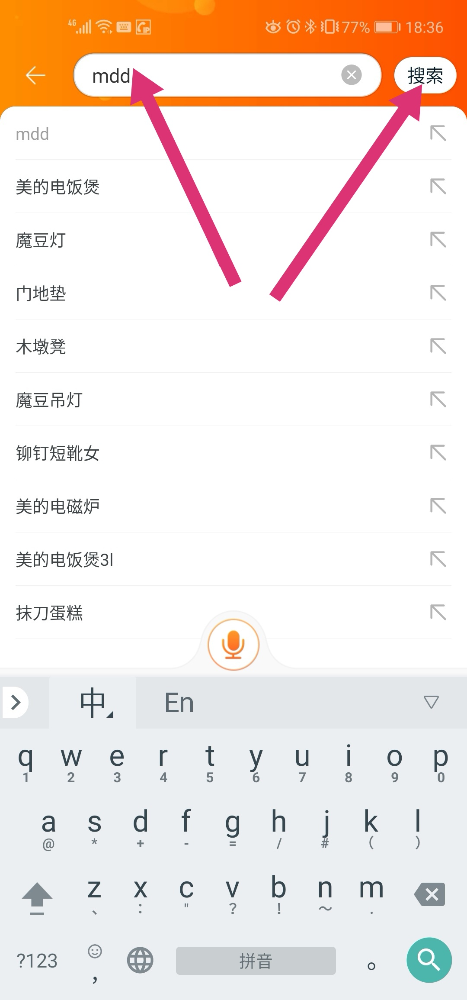

***
＞ Hさんのお見込みどおり、ドールに関係すると思しき商品が表示されました。
***

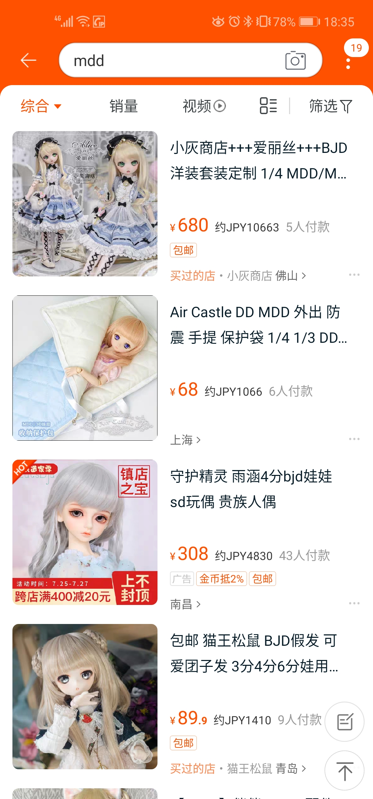

***
＞ Hさんは試しに、先日撮影した写真から、イメージ検索してみることにしました。
***

***
＞ Hさんは愛するMDDのレミちゃんの写真を、文字どおり光の速さで中国大陸へ送り込みました。写真の隅では水着姿のレムが、物憂げにHさんを見つめています。
***

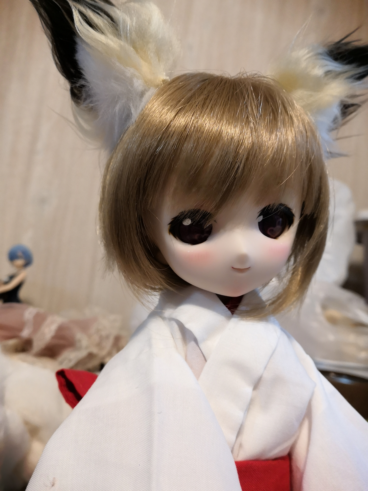

***
＞ アリババがレミちゃんの写真を1ビット残さず吸い付くした後、ドールに関する商品が表示されました。
***

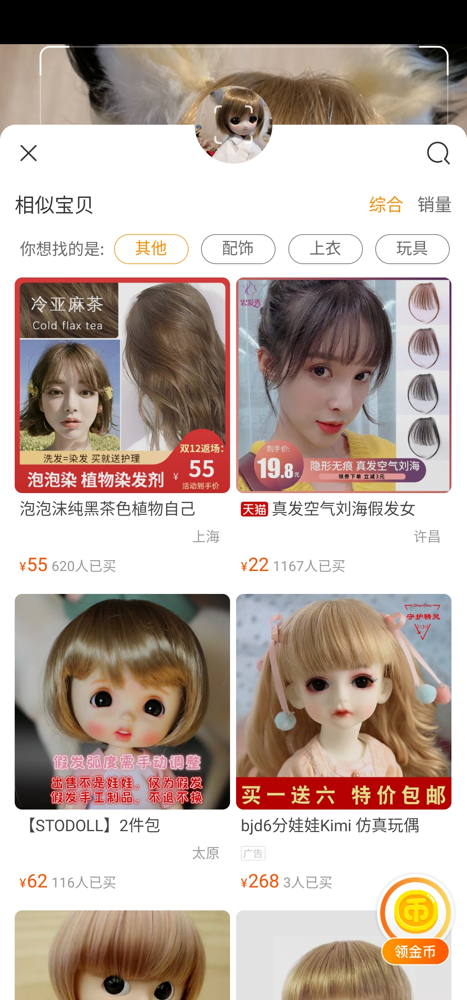

***
＞ Hさんは後日、知り合いの中国人から、ドールの服は中国語で「娃衣」が一般的だということを教えてもらいました。「娃衣 mdd」で検索したところ、お宝が沢山表示されました。
***

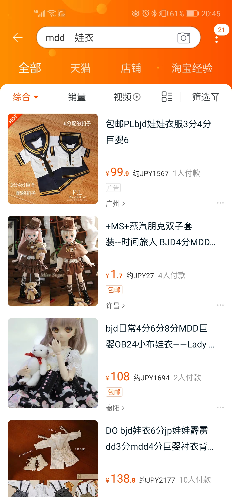

知り合いに中国人がいなくても、「mdd」の検索結果を注意深く読んでいれば、中国語で「娃衣」がドール服を示す単語であることに気づくことでしょう。この手探りでの宝探し感、サービス名であるタオバオや会社名であるアリババの名前にふさわしい体験ではないでしょうか。

## 価格表記
***
＞ Hさんは表示された検索結果に大興奮しました。もちろんお目当ての商品が表示されたことはもちろんですが、何より当初の目的はドール服を安価で手に入れること。表示されたドール服の価格は￥680と桁違いに安く、タオバオごと買えるんじゃないかという錯覚さえ起こしました。しかし、これはぬか喜びに終わります。日本円での表記は、￥680の右に小さい文字で10663JPYと書いてあるのでした。
***

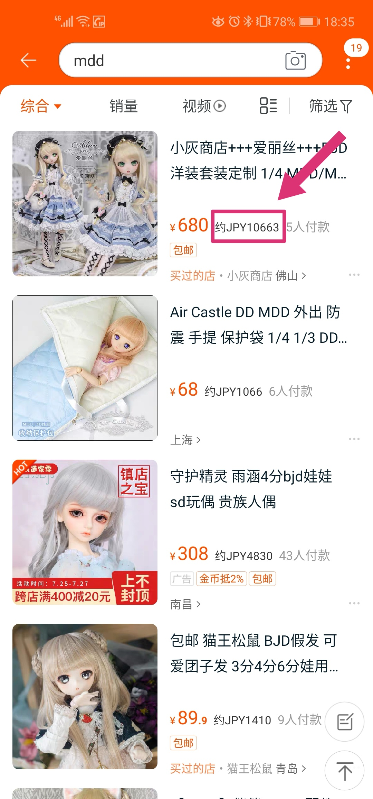

タオバオは中国国内での使用を想定しているので、中国元で価格を表示しています。中国において、中国円は日本と同じく「￥」で表示されるので、初見だと猛烈に安く感じるかもしれませんが、幻想です。2019年12月16日現在、1元＝15.62円です。

>コラム：中国でも日本でも、通貨記号に￥マークを使うのはなぜでしょうか。これは、中国の通貨である「元」と日本の通貨である「円」は、元々は同じ「○」を示す意味であることに由来しています。更にいうと、繁体字（旧字体）の「圓」から派生した文字です。韓国通貨の「ウォン」も通貨記号は₩ですが、元々の意味は同じく「○」を示す文字です。音はそれぞれ「yuan」「yen」「won」なので、どことなく面影があって面白いですね。

# 気に入った店舗や商品が見つかったら
## 商品の詳細をみる
***
＞ Hさんは、検索結果からとても可愛いアリスの服を発見したので、文字どおり光の速さで商品をタップしました。すると、商品ページが表示されました。
***

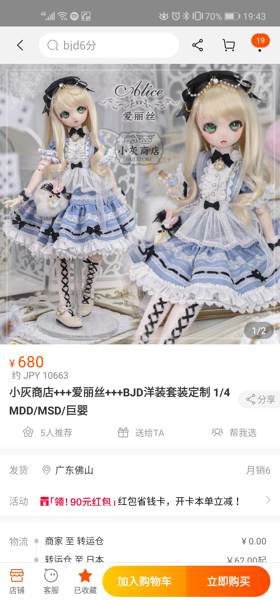

商品ページは大きく分けて４つのカテゴリに区分され、商品画面の上部にメニューとしても表示されています。
- 商品トップ（宝贝）
- カスタマーレビュー（评价）
- 商品詳細（详情）
- オススメ商品（推荐）

***
＞ Hさんは、商品詳細を確認し、水晶体をスマートフォンの画面に擦り付ける勢いでドール服のディテールをあまねく確認するのでした。
***

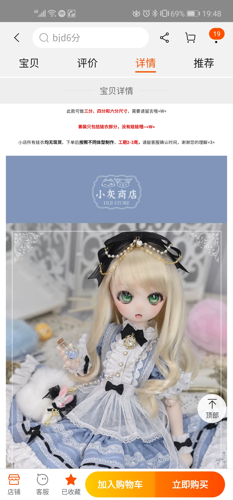

***
＞ ヘッドドレスは、リボンだけではなく、うさみみのもあるようですね。
***

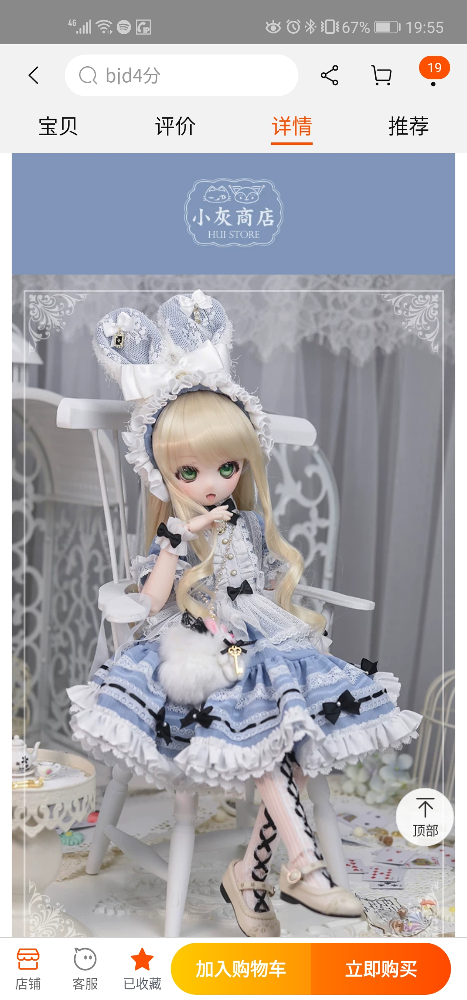

***
＞ Hさんは、写真をみる限りこのドール服はではとても可愛いので、他の人の評判も見てみたいと思うようになり、「评价」→「查看全部」の順にクリックし、カスタマーレビューを確認することにしました。
***
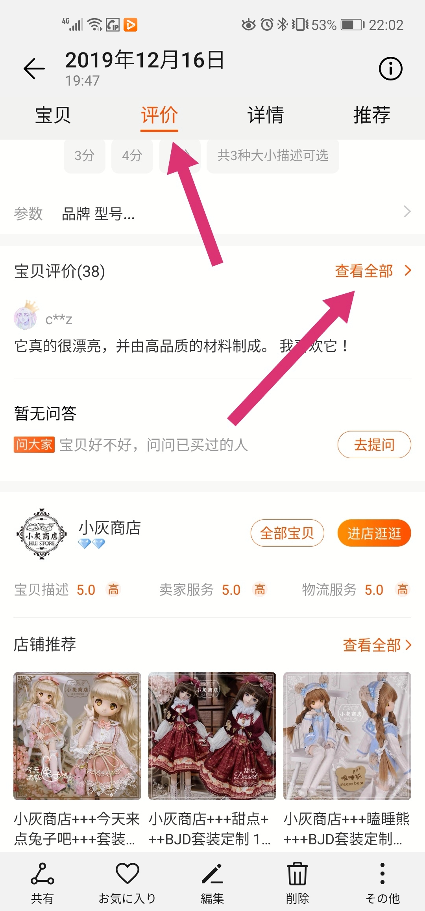

***
＞ すると、他の同志達の喜びの声が寄せられているではありませんか。
- 「最高に美しく、高品質な素材でできています。本当に嬉しい！」
- 「とても満足しました！！！ありがとう！！！」
- 「めっちゃく精巧にできています^o^」

Hさんは、自分の選球眼に狂いは無いことを確信したのでした。
***

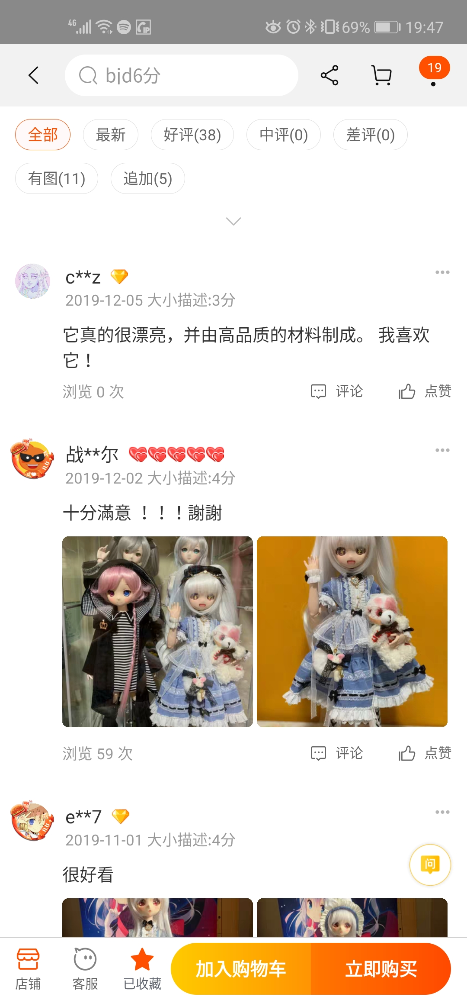

## お気に入り登録方法
- 商品をお気に入りに登録する
***
＞　Hさんは、このアリスの服がとても気に入ったので、画面左下にある星のマークを押し、お気に入りに登録したのでした。
***

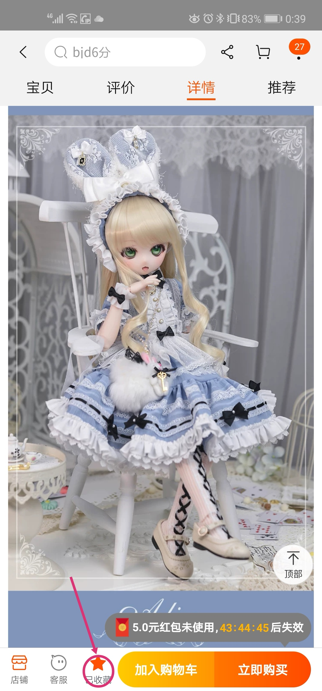

- お気に入りに登録した商品を確認する

    トップページから画面下メニューにある「我的淘宝」をクリックします

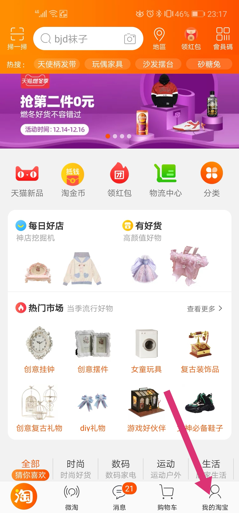

    画面上部にある「收藏夹」をクリックします

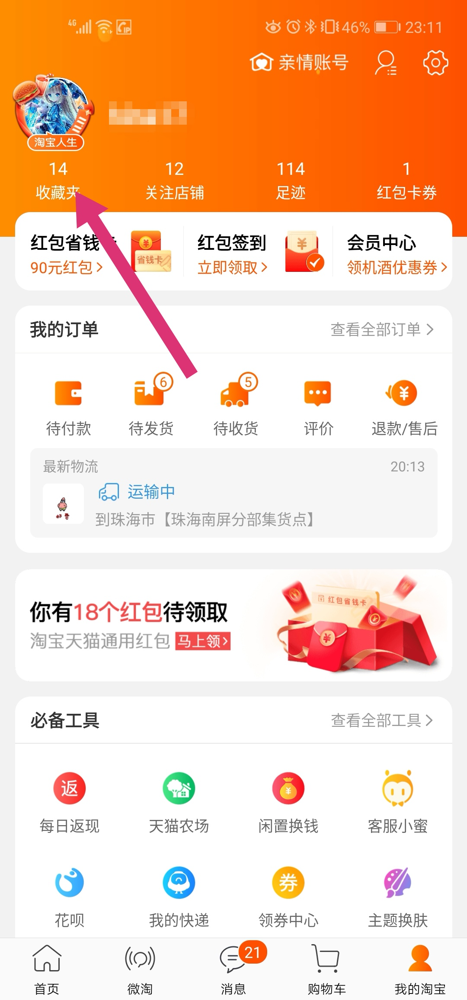

    お気に入り登録した商品が表示されます

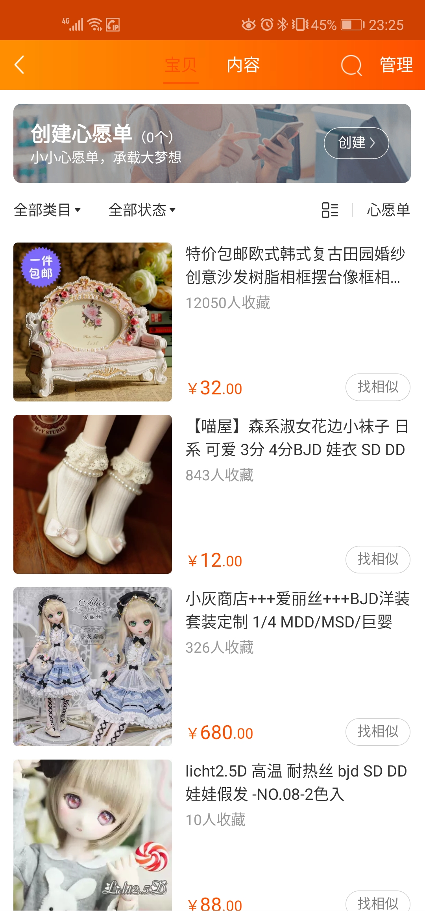

- 店舗をお気に入りに登録する

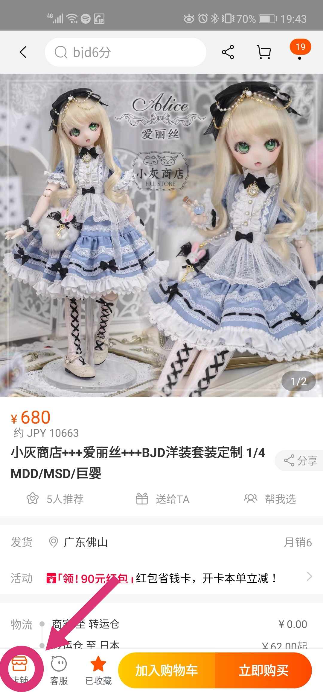

- お気に入りに登録した店舗を確認する

    画面上部にある「关注店铺」をクリックします

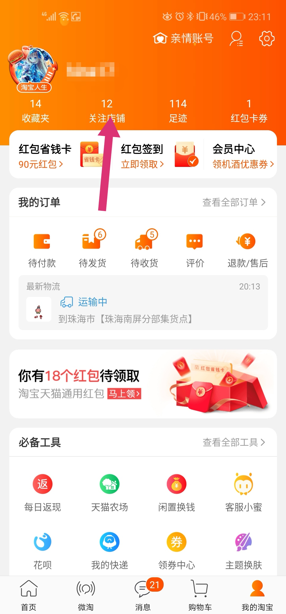

    お気に入り登録した店舗が表示されます

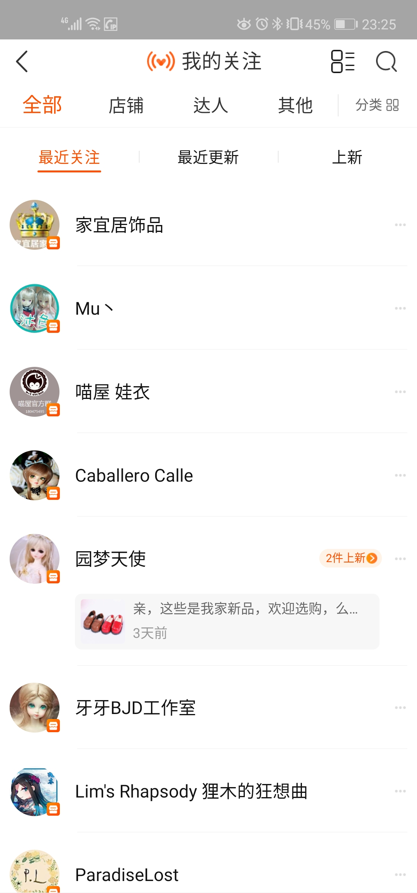

## 店に質問してみよう
タオバオでは、商品の購入前から店舗に気軽に質問することができる仕組みになっています。それは、古典的な通販サイトにある、「お問い合わせフォーム」のようなかしこまった方式ではなく、チャットアプリで友達に話しかけるように、ごく自然な流れで質問ができるような造りになっています。

店舗とのチャット画面は、商品画面の左下にある「客服」ボタンから開くことができます。

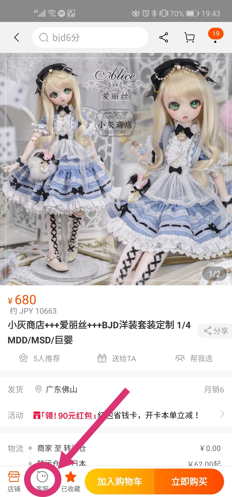

店舗画面からもチャット画面を開くことはできますが、商品画面から開くことで、特定の商品にフォーカスした質問であることをわざわざ文字で書かなくても、その商品に関する質問であることが自明になるので便利です。

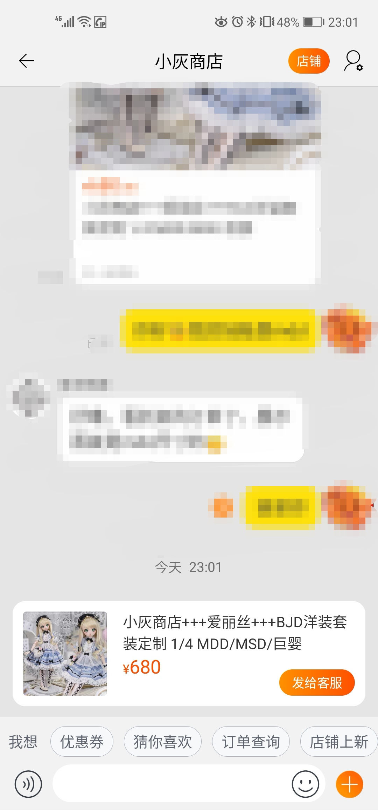

※もちろん、質問しなくて機械的に買い物はできます。しかし、タオバオは日本にあるどんな類似サービスよりも、店と消費者の距離が近いのです。これはタオバオの特徴でもあるので、慣れてきたら積極的に質問してみるのもよいでしょう。きっと新しい体験となることでしょう。
# いよいよ買ってみよう
## 商品説明に目を通そう
発送対象になる商品や納期は、商品ページに記載されているため、よく読みましょう。発注してからもキャンセルはできなくはないですが、事前によく読んでおくことに越したことはありません。
***
＞ Hさんは、いよいよ決心をして、アリス服を買うことにしました。光の速さで決済を進めたいところですが、ミスったときのダメージを考えて、商品画像のどれが送られてくるのかをきちんと確認することにしました。もちろん、アリス服を着ているドール本体が送られてこないことは、感覚的に理解できるものの、ヘッドドレスは？小物は？など、詳細に何が送られてくるのかを確認しました。より細かく説明を紐解いていくと、靴は送られてこないことがわかりました。
***
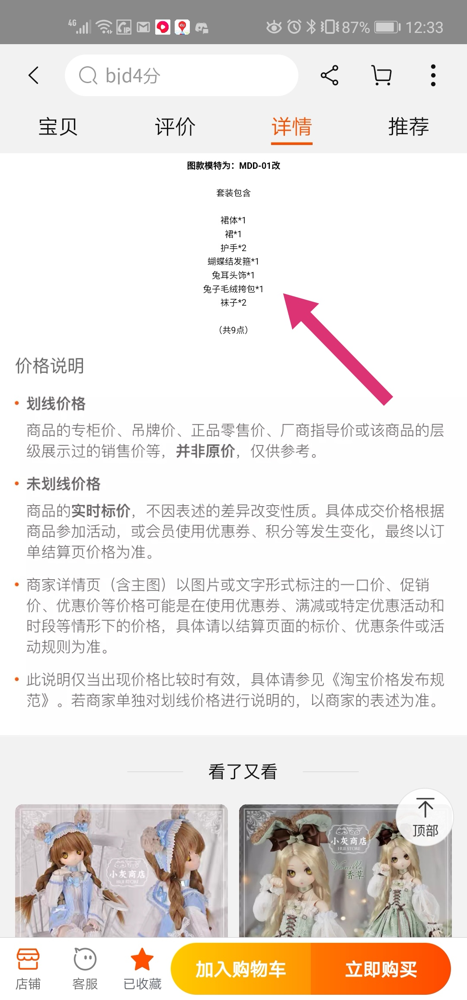

***
＞ この商品には、ドレス一式、手首につけるやつ、リボンヘッドドレス、うさみみヘッドドレス、うさカバン、靴下が含まれていますが、靴は含まれていませんでした。靴やアリス系の小物は別の店舗で購入することとして、取り急ぎこの商品の発注を進めることにしました。
***

## 買い物かごから買う方法
商品ページの右下にある「加入购物车」をクリックすると、買い物かごに入ります。この時点では、買い物かごに入っているだけなので、まだ決済はしていない状態です。

***
＞ Hさんは、アリス服を買い物かごに入れた後、その他のショップを物色し、商品を沢山買い物かごに放り込みました。
***

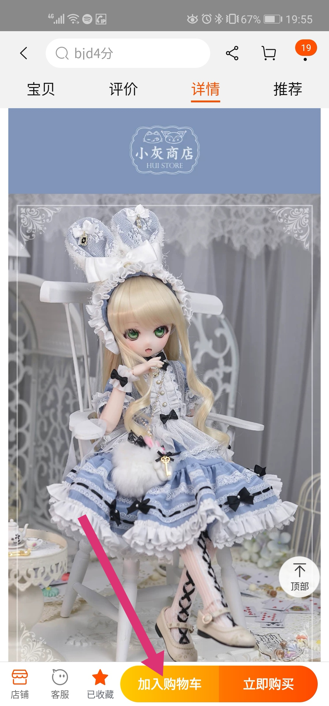

***
＞ Hさんは、めぼしい商品を買い物かごに入れたので、決済手続きを進めることにしました。
***

## 即買いする方法
商品ページの右下にある「立即购买」をクリックすると、ワンクリック発注になります。

## どうやって支払う？
- 国際クレジットカード（VISAなど）
- AliPay
- WechatPay

## 配送料は？
タオバオを通じて購入する際は、店舗→国際倉庫までの配送料と、国際倉庫→日本（あなたの家）までの配送料が個別にかかります。中国国内の業者としては、国際倉庫まで届けるところが配送の担当範囲です。
国際倉庫から先は、発注者が任意のタイミングでアプリから出荷指示を出します。この仕組みにより、国際倉庫→日本（あなたの家）までの荷物を複数店舗分まとめて配送できるため、配送料の節約が実現できるのです。

送料は、商品１点毎にかかるのではなく、発送単位にまとめて計算されます。店舗から国際倉庫までは日本の楽天やAmazonと同じ送料体系ですね。
なお、店舗→国際倉庫までの配送料は、無料の商品と有料の商品があります。

- 商家　至　转运仓：店舗から国際倉庫までの送料
- 转运仓　至　日本：国際倉庫から日本（あなたの家）までの送料

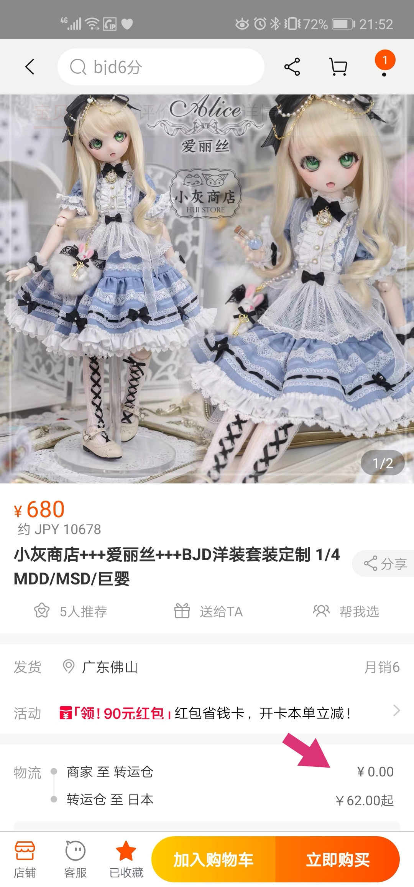

>コラム：この章では説明の都合上、タオバオアプリ上に表記されている「转运仓」を国際倉庫と意訳しました。ご存知のとおり、中国国内では簡体字が使われているため、私達に馴染みのない字が多く出てきますが、そのほとんどが私達が普段目にする当用漢字であり、簡体字だとわけがわからなくても、現代日本の漢字（新字体）に変換すると、実はほとんどの人が日常的に目にする漢字なのです。

>Tips：Google翻訳で簡体字→繁体字翻訳をすると、旧字体とほぼ同じ文字になり、読みやすくなるので、ちょっとした単語を調べる際には重宝します。例えば、「转运仓」は、转运仓（簡体字）→轉運倉（繁体字≒旧字体）となります。「轉」は新字体の「転」を表すので、私達が普段目にする漢字に変換すると、「転運倉」となります。どこかに転送するための一時的な倉庫だよ、というニュアンスがなんとなく伝わってきますね。
## 店からメッセージが来た！
