 
# タオバオで日本から商品を購入する方法
## タオバオとは
- 中国版Amazonもしくは楽天　の　**超高機能なやつ**
## タオバオ最強伝説
- 最強の商品数（2017年）
    - 15億点 ※Amazonは3億5000万点
- 最強のトランザクション性能（2017年）
    - 毎秒325,000取引を達成した
    - 3分間で2,000万取引を達成した
- 最強のロジスティクス性能
    - 午前0時の発注から12分後に、荷物が届いた
- 最強の評価数
    - 一日あたりの商品レビュー数は2,000万件
## タオバオで購入するメリット
- 中国の商品が手に入る　　　→　欲しい物が手に入る
- 商品の数が膨大に存在する　→　欲しい物が手に入る
- 同様の商品が日本より安い　→　経済合理性が高い（ただし、税金と通関手数料は別途かかる）
## タオバオで購入するデメリット
- 偽物があるかもしれない　→　トラブったときにだるい
- 品質が悪いかもしれない　→　金額が大きいとエモい
- 重かったり購入金額が小さいかったりすると配送料負けするかもしれない　→　経済合理性が低い
## 天猫（T-mall）との違いは？
- 天猫（T-mall）　 　→　ららぽーと
- タオバオ　　　　　→　ドン・キホーテ
# タオバオを覗いてみよう
## シナリオ
購入者（Hさんとします）は最近ドールをお迎えましたが、ドール服は日本で買うと一着3,000円～20,000円と、品質は良いのですがとても高価なので、破産するリスクがあります。中国ならコスプレ衣装も安いし、ワンチャン安く買えるのでは？と、お金に敏感なHさんは考えました。この物語は、HさんがタオバオでMDDの衣装を売っているかどうか、調べるところから始まります。
## アプリのダウンロード

***

＞ 手始めに、Hさんはタオバオのモバイルアプリをダウンロードし、起動しました。

***

iOSやAndroidのアプリストアから「タオバオ」で検索すると「淘宝手机」アプリが検索結果に表示されるので、これをダウンロードし、起動します。

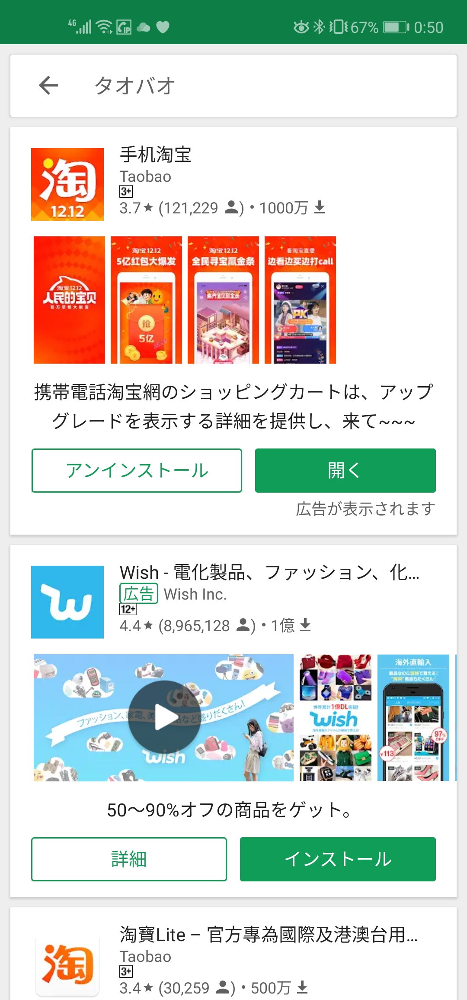

起動すると、位置情報から日本への配送モードに切り替えるかどうか訊かれるので、「立即切换日本站」をタップします。

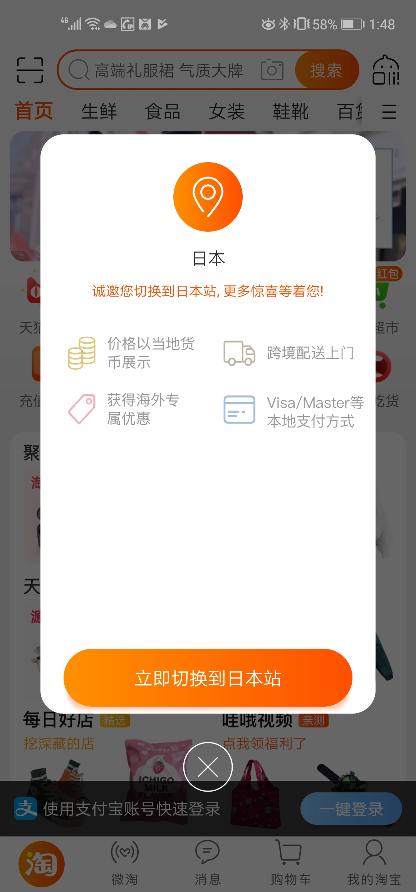

>コラム：タオバオにはPC版とモバイルアプリ版があります。タオバオは2003年にスタートしたため、PCブラウザでの使用を想定して構築されていましたが、近年、中国でスマホが爆発的に普及したことにより、2013年に全面的にモバイルアプリ向けにタオバオを再構築しています。

## アカウント開設方法
タオバオでの購入やお気に入りの登録にはアカウントの開設が必要です。見るだけなら必要ありませんが、折角なので開設していきましょう。

画面右下の「我的淘宝」をタップします。

タップ後に表示される画面の中程右側にある「注册」をタップし、アカウント登録をします。モバイルアプリはアカウント登録以降のスクリーンショットが撮れない仕様のため、以下のサイトを参考に、アカウントを開設してください。なお、SMSを受信できる環境が必須です。

ちなみに、タオバオのアカウントとアリペイのアカウントは共通なので、中国旅行の際などにアリペイのアカウントを作ったことがあればすぐにログインできます。

http://go.support-ec.com/2018/10/18/post-841/

## ログイン方法

画面右下の「我的淘宝」をタップします。

ログイン方法は、SMS経由による電話番号+ワンタイムパスワードによるログインと、ログインID+パスワードによるログイン、あるいはアリペイ連携によるログインの三種類があります。初期画面はSMS経由による電話番号+ワンタイムパスワードなので、ログインID+パスワードでログインする場合は、画面中央左側にある「帐号密码登录」をタップします。アプリ側の制約によりログイン画面のスクリーンショットが撮れないので、画面付きの解説は以下のサイトを参考にしてください。

http://go.support-ec.com/2018/10/18/post-841/

## 商品の検索方法
タオバオは中国国内での使用を想定し、サービスを提供していますので、基本的に日本語では検索できません。技術的にできないのではなく、商品説明に日本語が無いからマッチしません。楽天市場では中国語で検索できないのと同じですね。ですので、基本的には中国語で検索する必要があります。
- 中国語表記の調べ方
    - Google翻訳等の翻訳サービスで調べる
    - 英語で入力して目的の単語を類推する
    - 画像でイメージ検索する
    - 知り合いの中国人に調べてもらう（確実）

***

＞ Hさんは「ドール服」の中国語表記がわからなかったので、ドールの商品名を入力すれば何かしら出てくるだろうと思い「mdd」と入力し、「搜索」ボタンをタップして検索してみました。

***

***

＞ Hさんのお見込みどおり、ドールに関係すると思しき商品が表示されました。

***

***

＞ Hさんは試しに、先日撮影した写真から、イメージ検索してみることにしました。

***

***

＞ Hさんは愛するMDDの写真を、文字どおり光の速さで中国大陸へ送り込みました。写真の隅では水着姿のレムが、物憂げにHさんを見つめています。

***

***

＞ アリババがMDDの写真を1ビット残さず吸い付くした後、ドールに関する商品が表示されました。

***

***

＞ Hさんは後日、知り合いの中国人から、ドールの服は中国語で「娃衣」が一般的だということを教えてもらいました。「娃衣 mdd」で検索したところ、お宝が沢山表示されました。

***

知り合いに中国人がいなくても、「mdd」の検索結果を注意深く読んでいれば、中国語で「娃衣」がドール服を示す単語であることに気づくことでしょう。この手探りでの宝探し感、サービス名であるタオバオや会社名であるアリババの名前にふさわしい体験ではないでしょうか。

## 価格表記

***

＞ Hさんは表示された検索結果に大興奮しました。もちろんお目当ての商品が表示されたことはもちろんですが、何より当初の目的はドール服を安価で手に入れること。表示されたドール服の価格は￥680と桁違いに安く、タオバオごと買えるんじゃないかという錯覚さえ起こしました。しかし、これはぬか喜びに終わります。日本円での表記は、￥680の右に小さい文字で10663JPYと書いてあるのでした。

***

タオバオは中国国内での使用を想定しているので、中国元で価格を表示しています。中国において、中国円は日本と同じく「￥」で表示されるので、初見だと猛烈に安く感じるかもしれませんが、幻想です。2019年12月16日現在、1元＝15.62円です。

>コラム：中国でも日本でも、通貨記号に￥マークを使うのはなぜでしょうか。これは、中国の通貨である「元」と日本の通貨である「円」は、元々は同じ「○」を示す意味であることに由来しています。更にいうと、繁体字（旧字体）の「圓」から派生した文字です。韓国通貨の「ウォン」も通貨記号は₩ですが、元々の意味は同じく「○」を示す文字です。音はそれぞれ「yuan」「yen」「won」なので、どことなく面影があって面白いですね。

# 気に入った店舗や商品が見つかったら
## 商品の詳細をみる

***

＞ Hさんは、検索結果からとても可愛いアリスの服を発見したので、文字どおり光の速さで商品をタップしました。すると、商品ページが表示されました。

***

商品ページは大きく分けて４つのカテゴリに区分され、商品画面の上部にメニューとしても表示されています。
- 商品トップ（宝贝）
- カスタマーレビュー（评价）
- 商品詳細（详情）
- オススメ商品（推荐）

***

＞ Hさんは、商品詳細を確認し、水晶体をスマートフォンの画面に擦り付ける勢いでドール服のディテールをあまねく確認するのでした。

***

***

＞ ヘッドドレスは、リボンだけではなく、うさみみのもあるようですね。

***

***

＞ Hさんは、写真をみる限りこのドール服はではとても可愛いので、他の人の評判も見てみたいと思うようになり、「评价」→「查看全部」の順にタップし、カスタマーレビューを確認することにしました。

***

***

＞ すると、他の同志達の喜びの声が寄せられているではありませんか。
- 「最高に美しく、高品質な素材でできています。本当に嬉しい！」
- 「とても満足しました！！！ありがとう！！！」
- 「めっちゃく精巧にできています^o^」

Hさんは、自分の選球眼に狂いは無いことを確信したのでした。

***

# いよいよ買ってみよう
## 商品説明に目を通そう
発送対象になる商品や納期は、商品ページに記載されているため、よく読みましょう。発注してからもキャンセルはできなくはないですが、事前によく読んでおくことに越したことはありません。

***

＞ Hさんは、いよいよ決心をして、アリス服を買うことにしました。光の速さで決済を進めたいところですが、ミスったときのダメージを考えて、商品画像のどれが送られてくるのかをきちんと確認することにしました。もちろん、アリス服を着ているドール本体が送られてこないことは、感覚的に理解できるものの、ヘッドドレスは？小物は？など、詳細に何が送られてくるのかを確認しました。より細かく説明を紐解いていくと、靴は送られてこないことがわかりました。

***

***

＞ この商品には、ドレス一式、手首につけるやつ、リボンヘッドドレス、うさみみヘッドドレス、うさカバン、靴下が含まれていますが、靴は含まれていませんでした。靴やアリス系の小物は別の店舗で購入することとして、取り急ぎこの商品の発注を進めることにしました。

***

## 買い物かごから買う方法

***

＞ Hさんは、服のサイズを間違えないよう慎重に選択し、買い物かごに入れ、決済手続きを進めることにしました。

***

商品ページの右下にある「加入购物车」をタップすると、商品種類と個数を入力する画面が表示されます。

商品種類と個数を間違いなく入力し、「确定」ボタンをタップします。この時点では、買い物かごに入っているだけなので、まだ購入はしていない状態です。

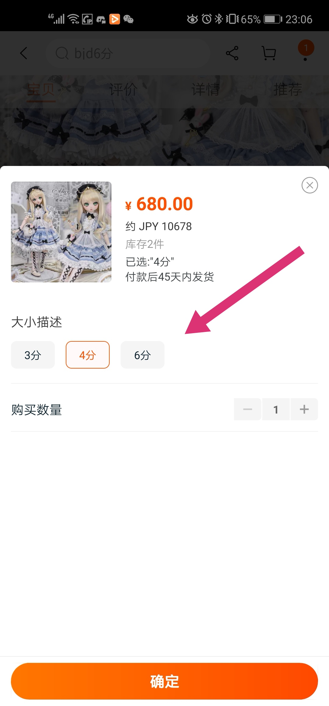

## どうやって支払う？

***

＞ Hさんは、注文を確定するために、買い物かご画面で購入する商品を確定し、住所を登録して、VISAカードで支払いました。

***

画面右上にある買い物かごマークをタップすると買い物かご画面に移動します。これは日本と同じですね。

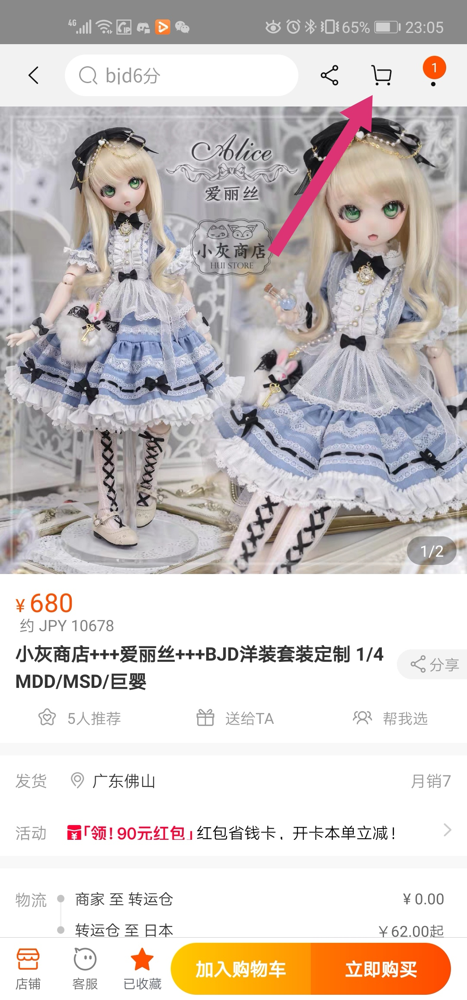

買い物かご画面では、買い物かごにいれた商品が表示されるので、チェックを入れて「结算」ボタンをタップします。

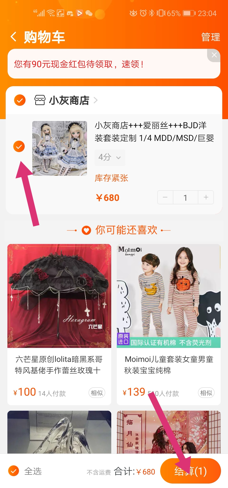

配送先の住所を登録します。

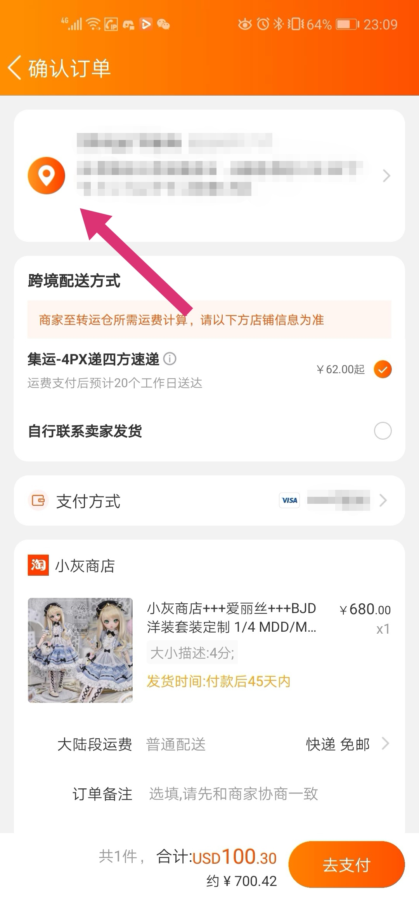

画面の上から順に以下の項目を入力し、右上の保存をタップします。入力は日本語でよいです。
- 氏名
- 電話番号（右は日本の国際番号である+81を選びましょう）
- 住所１（都道府県から市区町村まで選択します）
- 住所２（市区町村以降の住所を入力します）
- 郵便番号
- 以降は入力しなくてよいです（配送先のメモ、デフォルトの配送先にするかどうか）

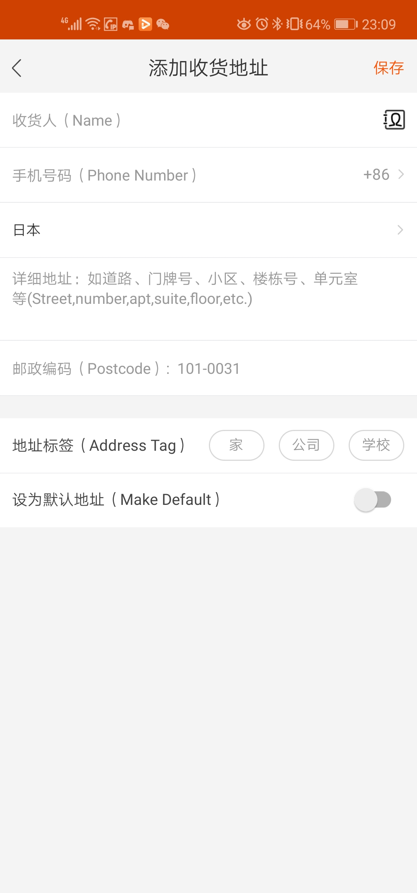

配送方式を選択します。「集远 - 4PX递四方速递」をチェックします。

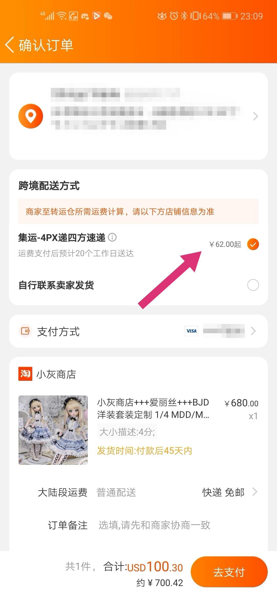

「支付方式」から、支払い方法を入力します。

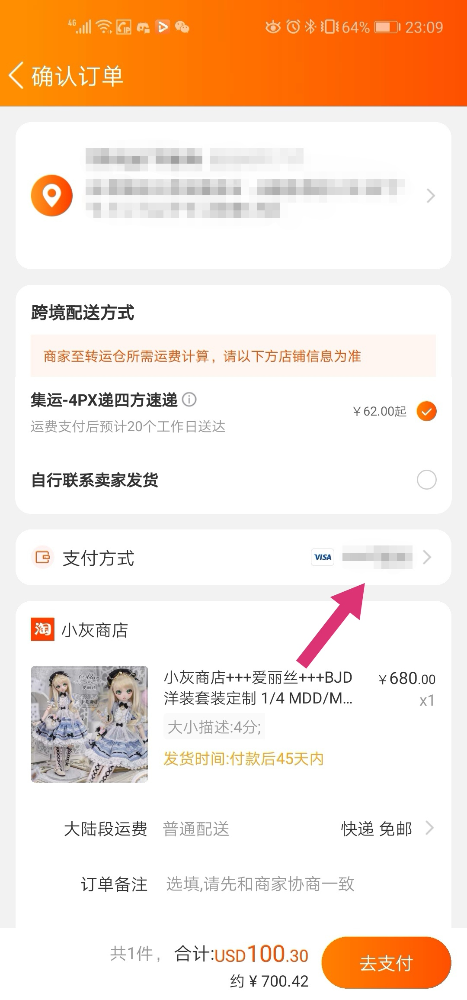

「使用新的Credit/Debit Card」をタップし、クレジットカードを登録します。

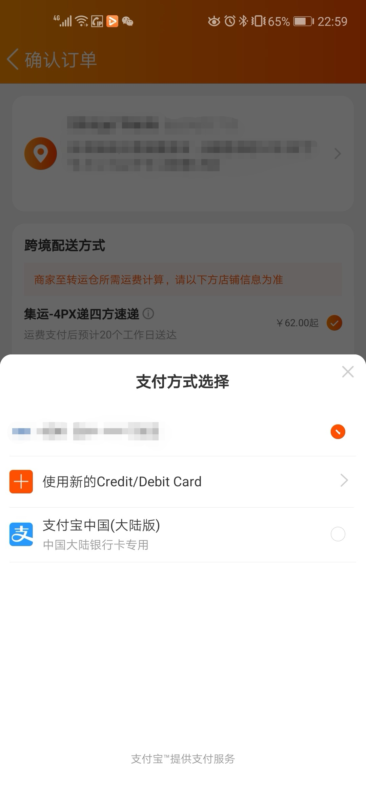

クレジットカード情報を入力し、「使用此卡」をタップします。

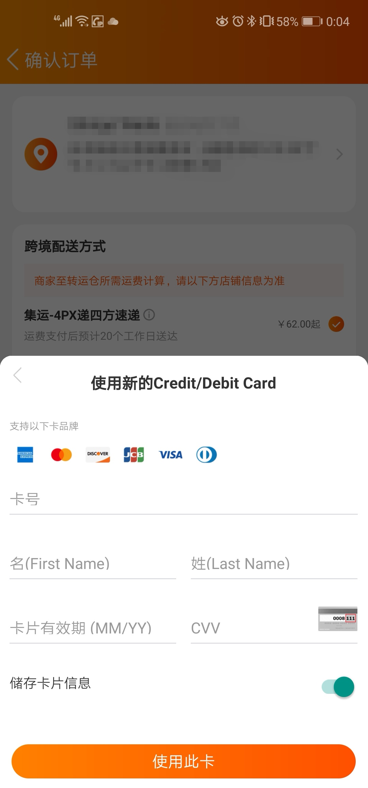

「支付方式」から登録したクレジットカードを選択し、「去支付」タップします。

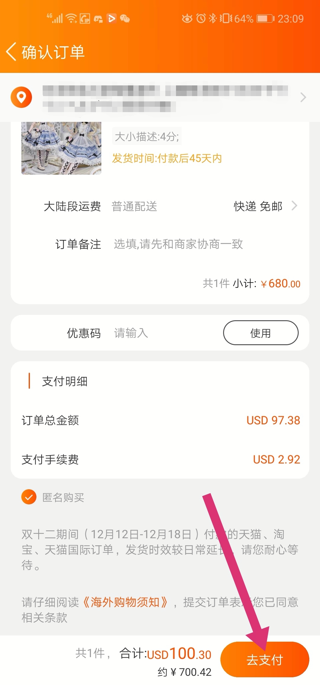

支払金額を確認し、「立即升级」をタップします。

>コラム：クレジットカード決済の場合、商品代金に加えて、手数料が3%上乗せされます。アリペイは手数料なしで使えますが、基本的に中国に銀行口座を保有していないと使えないので諦めましょう。最近、ツーリスト用のアリペイ口座に国際クレジットカードからチャージできるようになりましたが、タオバオで使えるかどうかはまだ検証していません。

決済完了です。購入金額については、関税との関連もあるので、後ほど詳しく説明します。

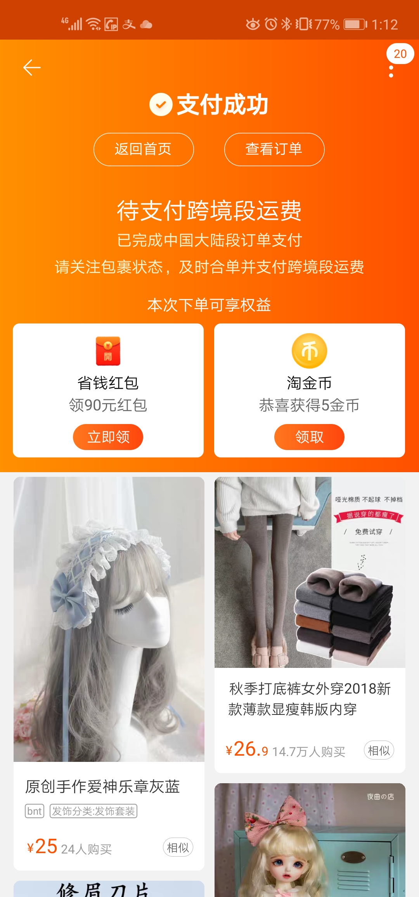

この段階では、店舗から転送倉庫までの配送料しか支払っていない状態です。別の画面から出荷指示をして、転送倉庫から日本までの配送料を支払う必要があります。こちらも詳しくは次以降の章で説明します。

## 転送倉庫への配送状況を確認しよう！

アリババの物流プラットフォーム「菜鳥網絡（cainiao）」はよくできてますね。

https://www.sbcloud.co.jp/entry/column/cainiao/

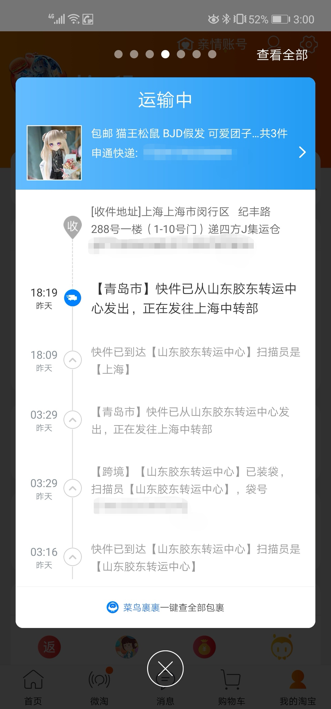

配送経路が地図と共に表示されます。

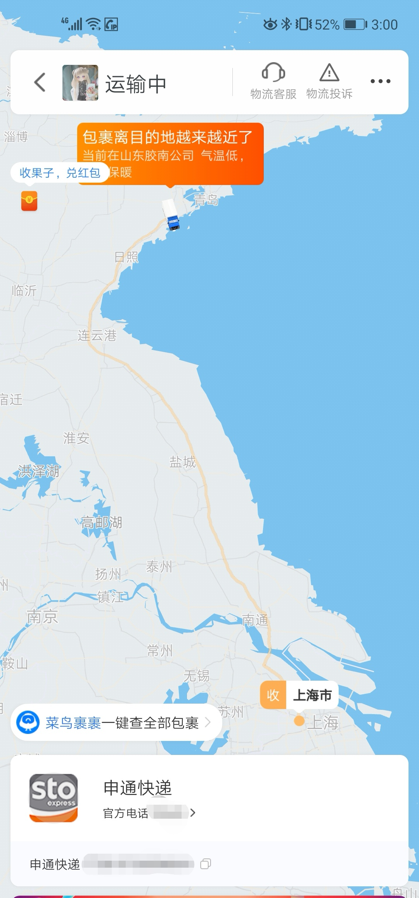

## 転送倉庫から日本へ配送を指示しよう！

***

＞ Hさんは、転送倉庫に集まってきた商品を、まとめて日本に配送しました。

***

転送倉庫に到着した商品は、20日間は無料で保管してくれるので、20日以内に日本への配送指示をかけるとよいでしょう。

トップページにある「物流中心」をタップします。

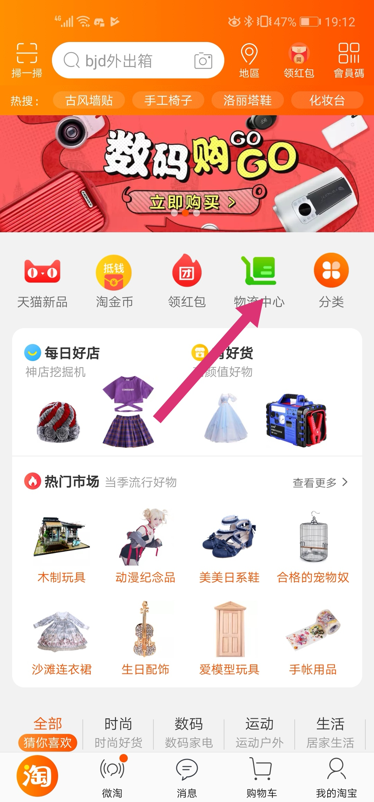

「去集运」をタップします。

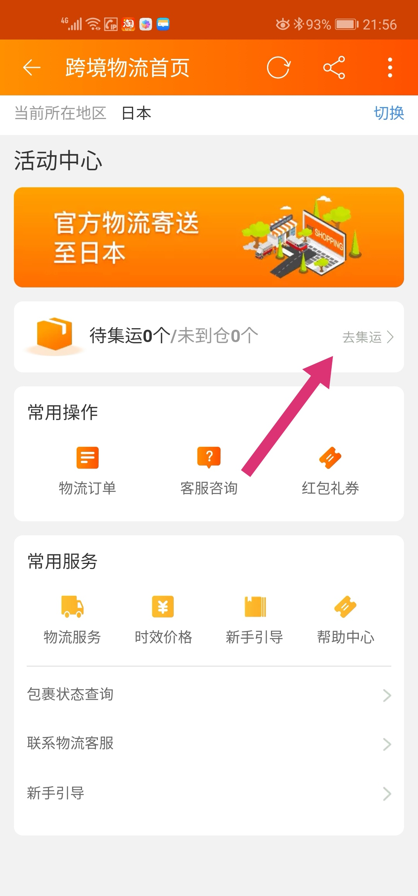

「查看」をタップします。ちなみに、ここに表示されている「4PX递四方速递」は深センに本社がある配送業者です。

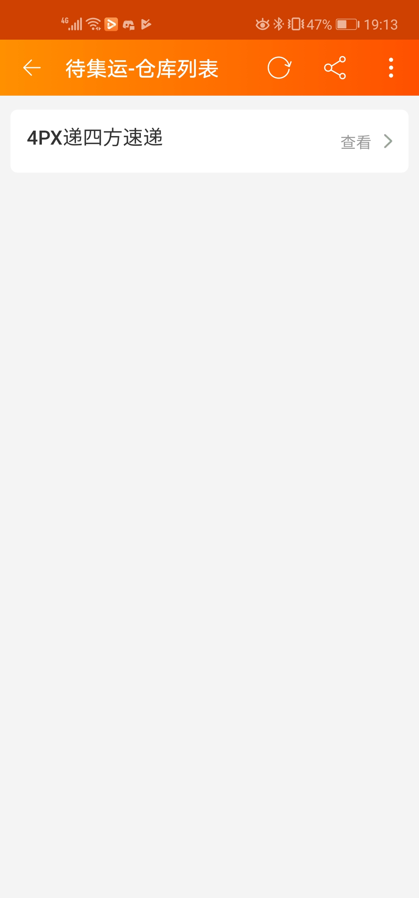

配送対象にする商品を選択して「运費结算」をタップします。荷物の重さに応じて運賃が変動します。一度に発送できる重量の上限は20kgです。

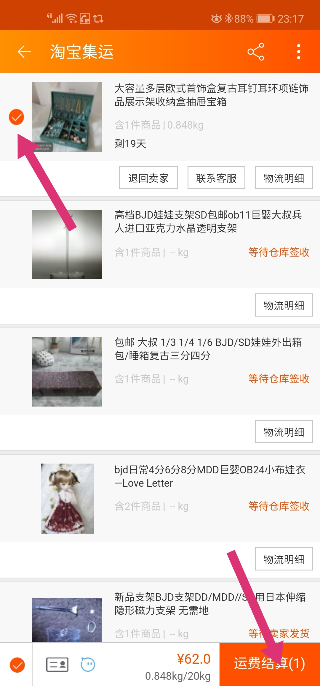

配送先の住所を選択して「确认订单」をタップします。

金額を確認のうえ、「继续支付」をタップします。

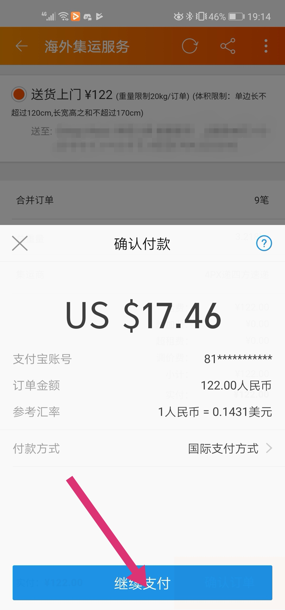

支払方法を確認のうえ、「Pay Now」をタップして支払いを確定します。

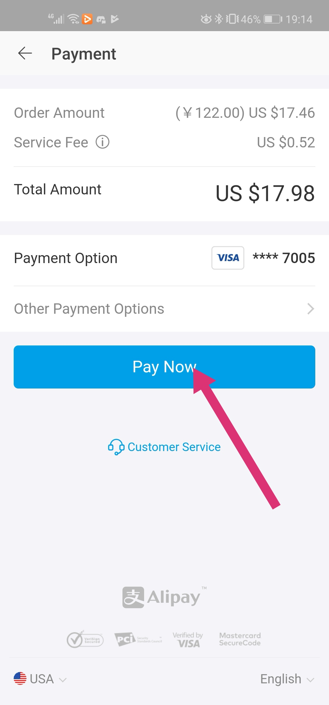

支付成功画面が表示され、無事に支払が完了しました。

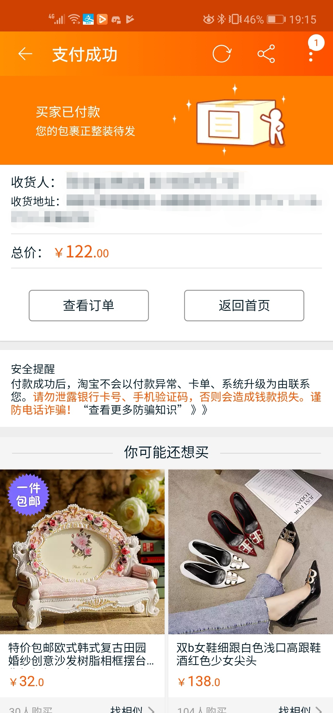

## 配送料は？
タオバオを通じて購入する際は、店舗→転送倉庫までの配送料と、転送倉庫→日本（あなたの家）までの配送料が個別にかかります。中国国内の業者としては、転送倉庫まで届けるところが配送の担当範囲です。
転送倉庫から先は、発注者が任意のタイミングでアプリから出荷指示を出します。この仕組みにより、転送倉庫→日本（あなたの家）までの荷物を複数店舗分まとめて配送できるため、配送料の節約が実現できるのです。

送料は、商品１点毎にかかるのではなく、発送単位にまとめて計算されます。店舗から転送倉庫までは日本の楽天やAmazonと同じ送料体系ですね。
なお、店舗→転送倉庫までの配送料は、無料の商品と有料の商品があります。

- 商家　至　转运仓：店舗から転送倉庫までの送料
- 转运仓　至　日本：転送倉庫から日本（あなたの家）までの送料

>コラム：この章では説明の都合上、タオバオアプリ上に表記されている「转运仓」を「転送倉庫」と意訳しました。ご存知のとおり、中国国内では簡体字が使われているため、私達に馴染みのない字が多く出てきますが、そのほとんどが私達が普段目にする当用漢字であり、簡体字だと読めなくても、現代日本の漢字（新字体）に変換してみると、日常的に目にする字だったりします。

>Tips：Google翻訳で簡体字を繁体字に翻訳をすると、旧字体とほぼ同じ文字になり、読みやすくなるので、ちょっとした単語を調べる際には重宝します。例えば、「转运仓」は、转运仓（簡体字）→轉運倉（繁体字≒旧字体）となります。「轉」は新字体の「転」を表すので、私達が普段目にする漢字に変換すると、「転運倉」となります。どこかに転送するための一時的な倉庫だよ、というニュアンスがなんとなく伝わってきますね。

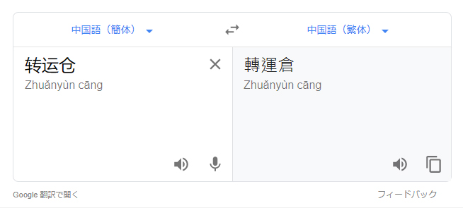

## 輸入にかかる税金や手数料は？
取引価格や品目に応じて、以下の税金及び手数料が課せられます。
- 関税
- 消費税
- 通関手数料

ただし、課税価格が10,000円以下の場合は免税となります。例外として、内国消費税（酒税・たばこ税）が課せられる商品は免税の適用はありません。また、免税除外品として限定列挙されている製品にも免税の適用はありません。
 > 課税価格＝商品価格×0.6×(1+関税率+消費税率)+通関手数料

詳しく知りたい方は、以下を参照してください。
- 税関ホームページ https://www.customs.go.jp/tetsuzuki/c-answer/imtsukan/1006_jr.htm
- 関税定率法第14条第18号 https://elaws.e-gov.go.jp/search/elawsSearch/elaws_search/lsg0500/detail?openerCode=1&lawId=143AC0000000054_20190401_431AC0000000011#226
- 関税定率法施行令第16条の三（関税を免除することを適当としない物品の指定） https://elaws.e-gov.go.jp/search/elawsSearch/elaws_search/lsg0500/detail?lawId=329CO0000000155&openerCode=1#265
- 関税定率法基本通達14-21（少額貨物の無条件免税） https://www.customs.go.jp/kaisei/zeikantsutatsu/kihon/TU-S47k0101-09~13.pdf
- 輸入品に対する内国消費税の徴収等に関する法律第13条第1項第1号 https://elaws.e-gov.go.jp/search/elawsSearch/elaws_search/lsg0500/detail?lawId=330AC0000000037#93

# トラブルシューティング
## 間違えて発注してしまった！
## 店からメッセージが来た！

# 便利機能いろいろ
## お気に入り機能
- 商品をお気に入りに登録する

- お気に入りに登録した商品を確認する

    トップページから画面下メニューにある「我的淘宝」をタップします

    画面上部にある「收藏夹」をタップします

    お気に入り登録した商品が表示されます

- 店舗をお気に入りに登録する

- お気に入りに登録した店舗を確認する

    画面上部にある「关注店铺」をタップします

    お気に入り登録した店舗が表示されます

## 店に質問してみよう
タオバオでは、商品の購入前から店舗に気軽に質問することができる仕組みになっています。それは、古典的な通販サイトにある、「お問い合わせフォーム」のようなかしこまった方式ではなく、チャットアプリで友達に話しかけるように、ごく自然な流れで質問ができるような造りになっています。

店舗とのチャット画面は、商品画面の左下にある「客服」ボタンから開くことができます。

店舗画面からもチャット画面を開くことはできますが、商品画面から開くことで、特定の商品にフォーカスした質問であることをわざわざ文字で書かなくても、その商品に関する質問であることが自明になるので便利です。

※もちろん、質問しなくて機械的に買い物はできます。しかし、タオバオは日本にあるどんな類似サービスよりも、店と消費者の距離が近いのです。これはタオバオの特徴でもあるので、慣れてきたら積極的に質問してみるのもよいでしょう。きっと新しい体験となることでしょう。
## クーポンで安く買おう
## 商品を評価しよう
## フレンド機能
中国人の友人「意味ない」
