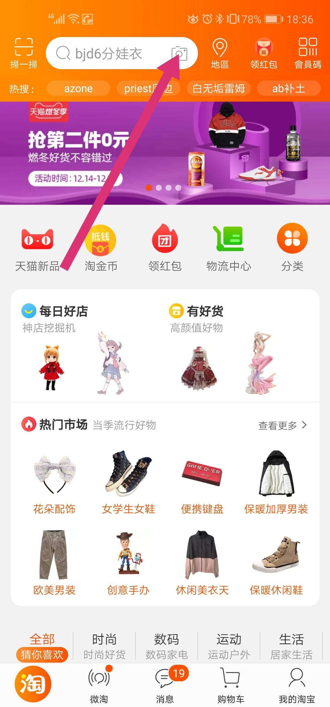

 
# タオバオで日本から商品を購入する方法
## タオバオとは
- 中国版Amazonもしくは楽天　の　**超高機能なやつ**
## タオバオ最強伝説
- 最強の商品数（2017年）
    - 15億点 ※Amazonは3億5000万点
- 最強のトランザクション性能（2017年）
    - 毎秒325,000取引を達成した
    - 3分間で2,000万取引を達成した
- 最強のロジスティクス性能
    - 午前0時の発注から12分後に、荷物が届いた
- 最強の評価数
    - 一日あたりの商品レビュー数は2,000万件
## タオバオで購入するメリット
- 中国の商品が手に入る　　　→　欲しい物が手に入る
- 商品の数が膨大に存在する　→　欲しい物が手に入る
- 同様の商品が日本より安い　→　経済合理性が高い
## タオバオで購入するデメリット
- 偽物があるかもしれない　→　トラブったときにだるい
- 品質が悪いかもしれない　→　金額が大きいとエモい
- 重かったり購入金額が小さいかったりすると配送料負けするかもしれない　→　経済合理性が低い
## 天猫（T-mall）との違いは？
- 天猫（T-mall）　 　→　ららぽーと
- タオバオ　　　　　→　ドン・キホーテ
# タオバオを覗いてみよう
## シナリオ
購入者（Hさんとします）は最近ドールをお迎えましたが、ドール服は日本で買うと一着3,000円～20,000円と、品質は良いのですがとても高価なので、破産するリスクがあります。中国ならコスプレ衣装も安いし、ワンチャン安く買えるのでは？と、お金に敏感なHさんは考えました。この物語は、HさんがタオバオでMDDの衣装を売っているかどうか、調べるところから始まります。
## 利用できるプラットフォーム
***
＞ 手始めに、Hさんはタオバオのモバイルアプリをダウンロードしました。
***
>コラム：タオバオにはPC版とモバイルアプリ版があります。タオバオは2003年にスタートしたため、PCブラウザでの使用を想定して構築されていましたが、近年、中国でスマホが爆発的に普及したことにより、2013年に全面的にモバイルアプリ向けにタオバオを再構築しています。
## アカウント開設方法
## ログイン方法
## 商品の検索方法
タオバオは中国国内での使用を想定し、サービスを提供していますので、基本的に日本語では検索できません。技術的にできないのではなく、商品説明に日本語が無いからマッチしません。楽天市場では中国語で検索できないのと同じですね。ですので、基本的には中国語で検索する必要があります。
- 中国語表記の調べ方
    - Google翻訳等の翻訳サービスで調べる
    - 英語で入力して目的の単語を類推する
    - 画像でイメージ検索する
    - 知り合いの中国人に調べてもらう（確実）

***
＞ Hさんは「ドール服」の中国語表記がわからなかったので、ドールの商品名を入力すれば何かしら出てくるだろうと思い「mdd」と入力し、「搜索」ボタンを押して検索してみました。
***

***
＞ Hさんのお見込みどおり、ドールに関係すると思しき商品が表示されました。
***

***
＞ Hさんは試しに、先日撮影した写真から、イメージ検索してみることにしました。
***

***
＞ Hさんは愛するMDDのレミちゃんの写真を、文字どおり光の速さで中国大陸へ送り込みました。写真の隅では水着姿のレムが、物憂げにHさんを見つめています。
***

***
＞ アリババがレミちゃんの写真を1ビット残さず吸い付くした後、ドールに関する商品が表示されました。
***

***
＞ Hさんは後日、知り合いの中国人から、ドールの服は中国語で「娃衣」が一般的だということを教えてもらいました。「娃衣 mdd」で検索したところ、お宝が沢山表示されました。
***

知り合いに中国人がいなくても、「mdd」の検索結果を注意深く読んでいれば、中国語で「娃衣」がドール服を示す単語であることに気づくことでしょう。この手探りでの宝探し感、サービス名であるタオバオや会社名であるアリババの名前にふさわしい体験ではないでしょうか。

## 価格表記
***
＞ Hさんは表示された検索結果に大興奮しました。もちろんお目当ての商品が表示されたことはもちろんですが、何より当初の目的はドール服を安価で手に入れること。表示されたドール服の価格は￥680と桁違いに安く、タオバオごと買えるんじゃないかという錯覚さえ起こしました。しかし、これはぬか喜びに終わります。日本円での表記は、￥680の右に小さい文字で10663JPYと書いてあるのでした。
***

タオバオは中国国内での使用を想定しているので、中国元で価格を表示しています。中国において、中国円は日本と同じく「￥」で表示されるので、初見だと猛烈に安く感じるかもしれませんが、幻想です。2019年12月16日現在、1元＝15.62円です。

>コラム：中国でも日本でも、通貨記号に￥マークを使うのはなぜでしょうか。これは、中国の通貨である「元」と日本の通貨である「円」は、元々は同じ「○」を示す意味であることに由来しています。更にいうと、繁体字（旧字）の「圓」から派生した文字です。韓国通貨の「ウォン」も通貨記号は₩ですが、元々の意味は同じく「○」を示す文字です。音はそれぞれ「yuan」「yen」「won」なので、どことなく面影があって面白いですね。

# 気に入った店舗や商品が見つかったら
## 商品の詳細をみる
***
＞ Hさんは、検索結果からとても可愛いアリスの服を発見したので、文字どおり光の速さで商品をタップしました。すると、商品ページが表示されました。
***

商品ページは大きく分けて４つのカテゴリに区分され、商品画面の上部にメニューとしても表示されています。
- 商品トップ（宝贝）
- カスタマーレビュー（评价）
- 商品詳細（详情）
- オススメ商品（推荐）

***
Hさんは、写真をみる限りこのドール服はではとても可愛いので、他の人の評判も見てみたいと思うようになり、「评价」→「查看全部」の順にクリックし、カスタマーレビューを確認することにしました。
***

***
すると、他の同志達の喜びの声が寄せられているではありませんか。
- 「最高に美しく、高品質な素材でできています。本当に嬉しい！」
- 「とても満足しました！！！ありがとう！！！」
- 「めっちゃく精巧にできています^o^」

Hさんは、自分の選球眼に狂いは無いことを確信したのでした。
***

## お気に入り登録方法
- 商品をお気に入りに登録する
***
＞　Hさんは、このアリスの服がとても気に入ったので、画面左下にある星のマークを押し、お気に入りに登録したのでした。
***
  

  
- 店舗をお気に入りに登録する

## 店に質問してみよう
タオバオでは、商品の購入前から店舗に気軽に質問することができる仕組みになっています。それは、古典的な通販サイトにある、「お問い合わせフォーム」のようなかしこまった方式ではなく、チャットアプリで友達に話しかけるように、ごく自然な流れで質問ができるような造りになっています。

店舗とのチャット画面は、商品画面の左下にある「客服」ボタンから開くことができます。店舗画面からもチャット画面を開くことはできますが、商品画面から開くことで、特定の商品にフォーカスした質問であることを文字で書かなくても自明になるので便利です。

※もちろん、質問しなくて機械的に買い物はできます。しかし、タオバオは日本にあるどんな類似サービスよりも、店と消費者の距離が近いのです。これはタオバオの特徴でもあるので、慣れてきたら積極的に質問してみるのもよいでしょう。きっと新しい体験となりますよ。
# いよいよ買ってみよう
## 商品説明に目を通そう
## 買い物かごから買う方法
## 即買いする方法
## どうやって支払う？
- 国際クレジットカード（VISAなど）
- AliPay
- WechatPay

## 配送料は？
## 店からメッセージが来た！
